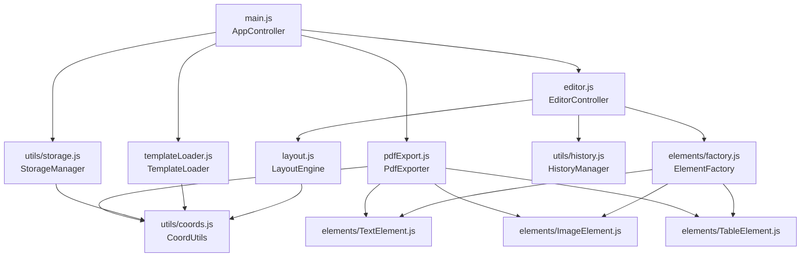
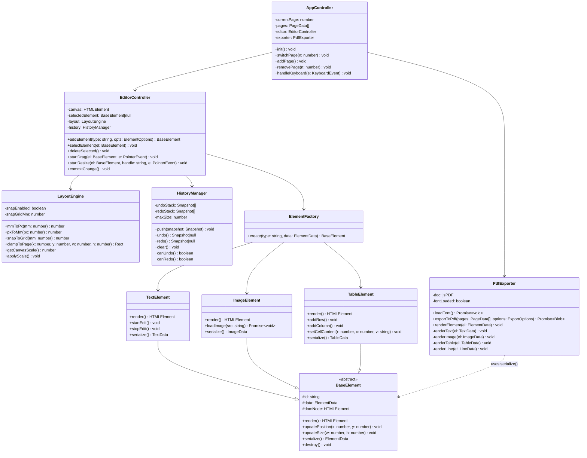
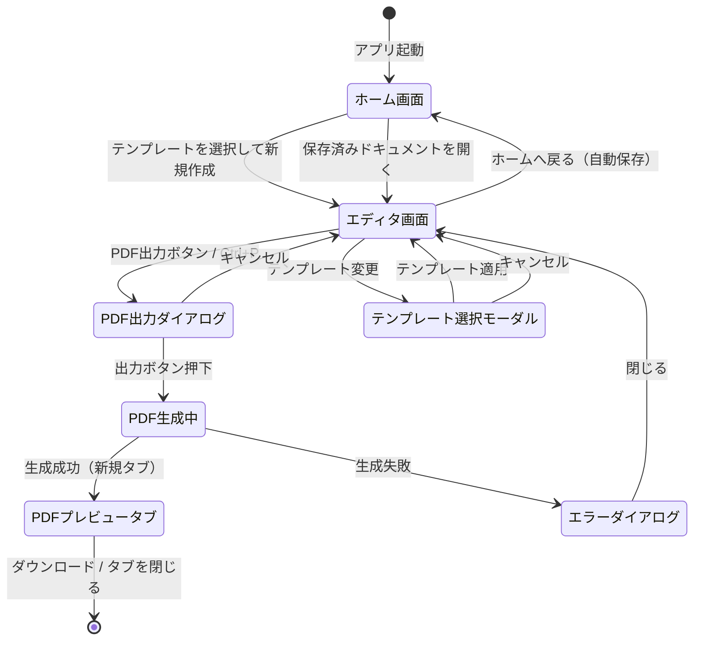
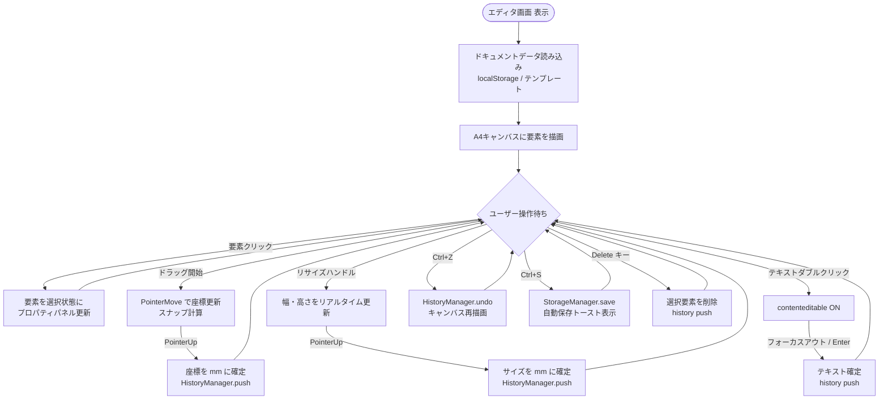
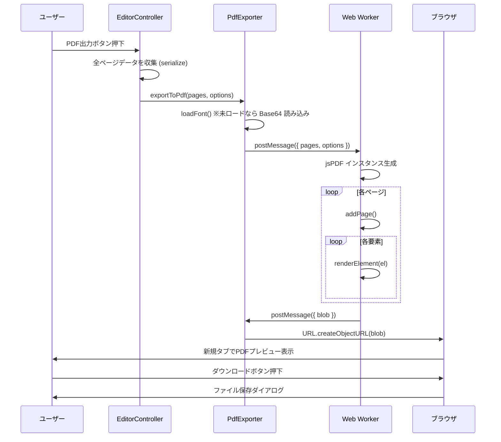

# 書類作成Webページ システム詳細設計書

| 項目 | 内容 |
|------|------|
| ドキュメント名 | 書類作成Webページ システム詳細設計書 |
| バージョン | 1.0 |
| 作成日 | 2026年04月03日 |
| 対応要件定義書 | 書類作成Webページ 要件定義書 v1.0 |
| 技術スタック | HTML5 / CSS3 / Vanilla JS (ES2022+) / jsPDF v2 |
| ステータス | ドラフト |

---

## 目次

1. [モジュール設計・クラス図](#1-モジュール設計クラス図)
2. [データ設計（JSON構造）](#2-データ設計json構造)
3. [画面遷移・UIフロー](#3-画面遷移uiフロー)
4. [API / 関数インターフェース](#4-api--関数インターフェース)
5. [エラーハンドリング方針](#5-エラーハンドリング方針)
6. [変更履歴](#6-変更履歴)

---

## 1. モジュール設計・クラス図

### 1.1 モジュール一覧

| モジュール | ファイルパス | 責務 |
|-----------|------------|------|
| AppController | `js/main.js` | アプリ初期化・画面ルーティング・イベントバス管理 |
| EditorController | `js/editor.js` | 要素の選択・追加・削除・ドラッグ操作の制御 |
| LayoutEngine | `js/layout.js` | 絶対座標管理・mm↔px変換・スナップ計算 |
| PdfExporter | `js/pdfExport.js` | jsPDFラッパー・フォント埋め込み・PDF書き出し |
| TemplateLoader | `js/templateLoader.js` | JSONテンプレート読み込み・初期要素生成 |
| StorageManager | `js/utils/storage.js` | localStorage 読み書き・シリアライズ |
| CoordUtils | `js/utils/coords.js` | mmToPx / pxToMm / ptToPx 変換ユーティリティ |
| HistoryManager | `js/utils/history.js` | Undo/Redo スタック管理 |
| ElementFactory | `js/elements/factory.js` | 各種要素（Text/Image/Table/Line）の生成 |
| TextElement | `js/elements/TextElement.js` | テキスト要素のDOM生成・編集・シリアライズ |
| ImageElement | `js/elements/ImageElement.js` | 画像要素のDOM生成・リサイズ・シリアライズ |
| TableElement | `js/elements/TableElement.js` | 表要素のDOM生成・セル編集・シリアライズ |

### 1.2 モジュール依存関係図



### 1.3 クラス設計



---

## 2. データ設計（JSON構造）

### 2.1 ドキュメント全体スキーマ

ドキュメント全体は以下の構造で `localStorage` に保存する。キーは `doceditor_doc_{uuid}` 形式。

```ts
interface Document {
  id: string;            // UUID v4
  title: string;         // ドキュメントタイトル
  templateType: "report" | "proposal";
  createdAt: string;     // ISO 8601
  updatedAt: string;     // ISO 8601
  pageSize: "A4";        // 将来: "B5" | "Letter"
  pages: PageData[];
}
```

### 2.2 ページデータスキーマ

```ts
interface PageData {
  id: string;
  pageNumber: number;    // 1-origin
  elements: ElementData[];
}
```

### 2.3 要素（Element）共通スキーマ

```ts
interface ElementData {
  id: string;
  type: "text" | "image" | "table" | "line";
  x: number;            // 用紙左端から (mm)
  y: number;            // 用紙上端から (mm)
  width: number;        // 要素幅 (mm)
  height: number;       // 要素高さ (mm) ※テキストは auto 計算後に更新
  locked: boolean;      // 移動・リサイズ禁止フラグ
  zIndex: number;       // 重なり順
}
```

### 2.4 各要素型の拡張スキーマ

#### TextData

```ts
interface TextData extends ElementData {
  type: "text";
  content: string;           // プレーンテキスト（改行は \n）
  fontFamily: "sans" | "serif";
  fontSize: number;          // pt
  fontWeight: "normal" | "bold";
  fontStyle: "normal" | "italic";
  color: string;             // "#rrggbb"
  backgroundColor: string;   // "#rrggbb" | "transparent"
  textAlign: "left" | "center" | "right" | "justify";
  lineHeight: number;        // 倍率 (例: 1.5)
}
```

#### ImageData

```ts
interface ImageData extends ElementData {
  type: "image";
  src: string;               // base64 data URL または object URL
  originalFileName: string;
  objectFit: "contain" | "cover" | "fill";
  opacity: number;           // 0.0–1.0
}
```

#### TableData

```ts
interface TableData extends ElementData {
  type: "table";
  rows: number;
  cols: number;
  cells: CellData[][];       // cells[row][col]
  headerRow: boolean;        // 1行目をヘッダーとして扱うか
  borderColor: string;
  borderWidth: number;       // pt
  headerBg: string;          // ヘッダー背景色
}

interface CellData {
  content: string;
  fontFamily: "sans" | "serif";
  fontSize: number;          // pt
  fontWeight: "normal" | "bold";
  color: string;
  backgroundColor: string;
  textAlign: "left" | "center" | "right";
  colSpan: number;           // デフォルト: 1
  rowSpan: number;           // デフォルト: 1
}
```

#### LineData

```ts
interface LineData extends ElementData {
  type: "line";
  orientation: "horizontal" | "vertical";
  strokeColor: string;
  strokeWidth: number;       // pt
  strokeStyle: "solid" | "dashed" | "dotted";
}
```

### 2.5 テンプレート定義スキーマ

`js/templates/report.json` / `proposal.json` の構造。

```ts
interface TemplateDefinition {
  id: string;
  name: string;
  description: string;
  thumbnail: string;         // base64 PNG
  defaultPageCount: number;
  pages: TemplatePageData[];
}

interface TemplatePageData {
  pageNumber: number;
  label: string;             // 例: "表紙", "本文1"
  elements: ElementData[];   // 初期配置要素
}
```

### 2.6 localStorage キー定義

| キー | 型 | 説明 |
|------|----|------|
| `doceditor_index` | `string[]` | 保存ドキュメントIDの一覧 |
| `doceditor_doc_{id}` | `Document` | ドキュメント本体 |
| `doceditor_settings` | `AppSettings` | アプリ設定（スナップON/OFF等） |
| `doceditor_draft` | `Document` | 自動保存ドラフト（5分毎） |

```ts
interface AppSettings {
  snapEnabled: boolean;
  snapGridMm: number;        // デフォルト: 5
  canvasScale: number;       // 最後に使用したスケール
  defaultFontFamily: "sans" | "serif";
  defaultFontSize: number;   // pt
}
```

---

## 3. 画面遷移・UIフロー

### 3.1 画面遷移図



### 3.2 エディタ画面 内部フロー



### 3.3 PDF出力フロー



### 3.4 画面レイアウト構成

```
┌─────────────────────────────────────────────────────────────┐
│  ツールバー (height: 48px, position: sticky)                 │
│  [ロゴ] [テンプレート] [画像追加] [表追加] │ ... │ [PDF出力] │
└─────────────────────────────────────────────────────────────┘
┌──────────┬───────────────────────────────┬───────────────────┐
│ ページ   │         キャンバスエリア        │  プロパティパネル  │
│ ナビゲー │  ┌─────────────────────────┐  │  [座標 (mm)]      │
│ ター     │  │     A4 キャンバス        │  │  X: [____]        │
│ (180px)  │  │   794px × 1123px        │  │  Y: [____]        │
│          │  │   position: relative    │  │  W: [____]        │
│ [p.1 □] │  │                         │  │  H: [____]        │
│ [p.2 □] │  │  ┌──────────────────┐   │  │  フォント(pt)      │
│ [p.3 □] │  │  │ position:absolute│   │  │  [____]           │
│  [+ 追加]│  │  │ left: mmToPx(x)  │   │  │  カラー           │
│          │  │  │ top:  mmToPx(y)  │   │  │  [■][■][■]    │
│          │  │  └──────────────────┘   │  │                   │
│          │  └─────────────────────────┘  │  [PDF出力]ボタン  │
└──────────┴───────────────────────────────┴───────────────────┘
```

---

## 4. API / 関数インターフェース

### 4.1 `js/utils/coords.js`

座標変換ユーティリティ。副作用なし・純粋関数。

```ts
/** 96dpi 基準の mm → px 変換 */
export function mmToPx(mm: number): number;

/** 96dpi 基準の px → mm 変換 */
export function pxToMm(px: number): number;

/** ポイント → px 変換 (1pt = 1/72 inch) */
export function ptToPx(pt: number): number;

/** px → ポイント変換 */
export function pxToPt(px: number): number;

/** A4 サイズの定数 */
export const A4_W_MM: 210;
export const A4_H_MM: 297;
export const A4_W_PX: number;   // ≈ 794
export const A4_H_PX: number;   // ≈ 1123

/** ページ内に収まるよう座標をクランプ */
export function clampToPage(
  x: number, y: number,
  w: number, h: number,
  margin?: number          // デフォルト: 0
): { x: number; y: number; w: number; h: number };
```

### 4.2 `js/layout.js` — LayoutEngine

```ts
class LayoutEngine {
  constructor(canvasEl: HTMLElement);

  /** スナップ機能のON/OFF切り替え */
  setSnap(enabled: boolean, gridMm?: number): void;

  /** mm 座標をスナップグリッドに吸着 */
  snapToGrid(mm: number): number;

  /** ウィンドウサイズに応じたキャンバス拡縮率を計算して適用 */
  applyScale(): void;

  /** 現在のスケール値を返す */
  getCanvasScale(): number;

  /**
   * DOM 要素の style を mm 座標から設定する
   * @param el - 対象 DOM 要素
   * @param data - { x, y, width, height } (mm)
   */
  applyPosition(el: HTMLElement, data: Pick<ElementData, 'x'|'y'|'width'|'height'>): void;
}
```

### 4.3 `js/editor.js` — EditorController

```ts
class EditorController {
  constructor(canvasEl: HTMLElement, layout: LayoutEngine, history: HistoryManager);

  /**
   * 要素を追加してキャンバスに描画する
   * @param type - 'text' | 'image' | 'table' | 'line'
   * @param opts - 初期座標・サイズ・スタイル (すべて mm/pt 単位)
   * @returns 生成した BaseElement インスタンス
   */
  addElement(type: ElementType, opts?: Partial<ElementData>): BaseElement;

  /** 要素を選択状態にして PropertyPanel を更新する */
  selectElement(el: BaseElement | null): void;

  /** 現在選択中の要素を返す */
  getSelected(): BaseElement | null;

  /** 選択中の要素を削除してHistoryに積む */
  deleteSelected(): void;

  /**
   * ドラッグ処理を開始する
   * pointermove / pointerup は内部でリスナー登録・解除する
   */
  startDrag(el: BaseElement, startEvent: PointerEvent): void;

  /**
   * リサイズ処理を開始する
   * @param handle - 'nw'|'n'|'ne'|'e'|'se'|'s'|'sw'|'w'
   */
  startResize(el: BaseElement, handle: ResizeHandle, startEvent: PointerEvent): void;

  /** 全要素をシリアライズして PageData.elements として返す */
  serializeElements(): ElementData[];

  /** PageData.elements から全要素を再構築してキャンバスに描画 */
  loadElements(elements: ElementData[]): void;

  /** キャンバスをクリアする */
  clearCanvas(): void;
}
```

### 4.4 `js/pdfExport.js` — PdfExporter

```ts
interface ExportOptions {
  fileName?: string;       // デフォルト: "document_YYYYMMDDHHmm.pdf"
  pageRange?: number[];    // 出力するページ番号 (1-origin)。未指定は全ページ
  openPreview?: boolean;   // 生成後に新規タブでプレビューするか (デフォルト: true)
  metadata?: {
    title?: string;
    author?: string;
    subject?: string;
  };
}

class PdfExporter {
  constructor();

  /**
   * フォント (Noto Sans/Serif JP) を非同期で読み込む
   * 初回のみネットワーク or キャッシュから取得
   */
  loadFont(): Promise<void>;

  /**
   * ページデータ配列を受け取り PDF Blob を返す
   * 内部で Web Worker を使用して非同期生成する
   * @throws {PdfExportError} フォント未ロード・要素変換失敗時
   */
  exportToPdf(pages: PageData[], options?: ExportOptions): Promise<Blob>;

  /**
   * Blob から object URL を生成して新規タブで開く
   */
  previewInNewTab(blob: Blob): void;

  /**
   * Blob をファイルとしてダウンロードする
   */
  downloadBlob(blob: Blob, fileName: string): void;
}
```

### 4.5 `js/utils/storage.js` — StorageManager

```ts
class StorageManager {
  /**
   * ドキュメントを localStorage に保存する
   * ドキュメントサイズが 4MB を超える場合は警告を返す
   */
  save(doc: Document): { success: boolean; warning?: string };

  /**
   * ID からドキュメントを復元する
   * @returns ドキュメントが存在しない場合は null
   */
  load(id: string): Document | null;

  /** 保存済みドキュメントの一覧を返す（新しい順） */
  list(): Pick<Document, 'id' | 'title' | 'updatedAt' | 'templateType'>[];

  /** ドキュメントを削除する */
  remove(id: string): void;

  /** 自動保存ドラフトを書き込む */
  saveDraft(doc: Document): void;

  /** 自動保存ドラフトを読み込む */
  loadDraft(): Document | null;

  /** ドラフトを削除する */
  clearDraft(): void;
}
```

### 4.6 `js/utils/history.js` — HistoryManager

```ts
type Snapshot = {
  pageId: string;
  elements: ElementData[];   // deep copy
  timestamp: number;
};

class HistoryManager {
  constructor(maxSize?: number);  // デフォルト: 50

  /** 現在の状態をスタックに積む */
  push(snapshot: Snapshot): void;

  /**
   * Undo: ひとつ前のスナップショットを返し、現在状態をRedoスタックへ移動
   * @returns スナップショット。スタックが空なら null
   */
  undo(): Snapshot | null;

  /**
   * Redo: やり直しスタックの先頭を返し、Undoスタックへ移動
   * @returns スナップショット。スタックが空なら null
   */
  redo(): Snapshot | null;

  canUndo(): boolean;
  canRedo(): boolean;
  clear(): void;
}
```

### 4.7 `js/elements/factory.js` — ElementFactory

```ts
class ElementFactory {
  constructor(layout: LayoutEngine);

  /**
   * 型に応じた BaseElement サブクラスを生成して返す
   * @param type - 'text' | 'image' | 'table' | 'line'
   * @param data - ElementData またはサブ型
   */
  create(type: ElementType, data: ElementData): BaseElement;
}
```

### 4.8 イベントバス仕様

モジュール間通信は DOM の `CustomEvent` をイベントバスとして使用する。グローバルな `window` または専用の `EventTarget` インスタンスを使う。

| イベント名 | 発火元 | ペイロード | 購読先 |
|-----------|--------|-----------|--------|
| `element:selected` | EditorController | `{ element: BaseElement \| null }` | PropertyPanel |
| `element:changed` | BaseElement | `{ id: string, data: ElementData }` | AppController (自動保存トリガー) |
| `page:switched` | AppController | `{ pageNumber: number }` | PageNavigator |
| `pdf:progress` | PdfExporter | `{ percent: number }` | ProgressBar |
| `pdf:done` | PdfExporter | `{ blob: Blob, fileName: string }` | AppController |
| `history:changed` | HistoryManager | `{ canUndo: boolean, canRedo: boolean }` | Toolbar |

---

## 5. エラーハンドリング方針

### 5.1 エラー種別と対処

| エラー種別 | 発生箇所 | 対処 |
|-----------|---------|------|
| フォント読み込み失敗 | `PdfExporter.loadFont()` | フォールバックフォントで続行・警告トースト表示 |
| localStorage 容量超過 | `StorageManager.save()` | エラーダイアログ表示・ドキュメントのエクスポート（JSON DL）を促す |
| PDF 生成エラー | `PdfExporter.exportToPdf()` | エラーダイアログ表示・コンソールにスタックトレース出力 |
| 画像読み込み失敗 | `ImageElement.loadImage()` | プレースホルダー表示・警告アイコン付与 |
| 不正な座標値 | `LayoutEngine.applyPosition()` | `clampToPage()` で自動補正・警告ログ |

### 5.2 カスタムエラークラス

```ts
class PdfExportError extends Error {
  constructor(message: string, public readonly cause?: unknown) {
    super(message);
    this.name = 'PdfExportError';
  }
}

class StorageError extends Error {
  constructor(message: string, public readonly code: 'QUOTA_EXCEEDED' | 'PARSE_ERROR') {
    super(message);
    this.name = 'StorageError';
  }
}
```

---

## 6. 変更履歴

| バージョン | 日付 | 変更内容 | 担当 |
|-----------|------|---------|------|
| 1.0 | 2026/04/03 | 初版作成 | いずき |
